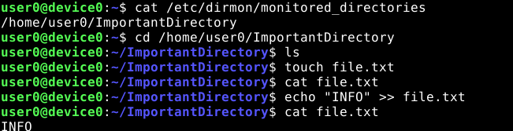
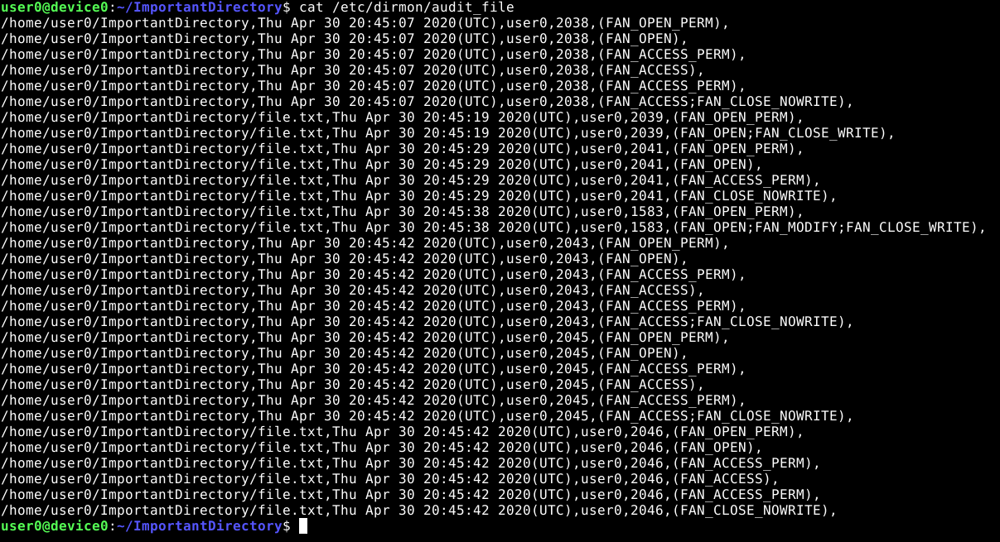

# dirmon
Directory Monitoring Software for GNU/Linux
Tested on Debian 10, Linux Kernel 4.19.0-8-amd64

# Installation is easy!

Download install.sh

	wget https://raw.githubusercontent.com/matthewsilva/dirmon/master/install.sh
        
Change the install.sh permissions
        
        chmod 777 install.sh
        
Run the install script as root
        
       sudo ./install.sh
       
# Monitoring Instructions

You'll need to restart your system to begin monitoring (because dirmon is now set up as a startup service with cron)

Enter each directory you would like to monitor into /etc/dirmon/monitored_directories , one per line

Fig 1. Accessing files in a monitored directory

# Viewing File Access Events

See the result of your auditing in /etc/dirmon/audit_file (feel free to remove this file if you want to clear out old info)

Fig 2. Viewing audited file accesses for the monitored directory

# Dirmon Options

You can run dirmon --help in a terminal to see the format for running the dirmon command.

Feel free to edit /etc/dirmon/dirmon_service to specify which events you would like to be recorded. All types of file access are recorded by default.
